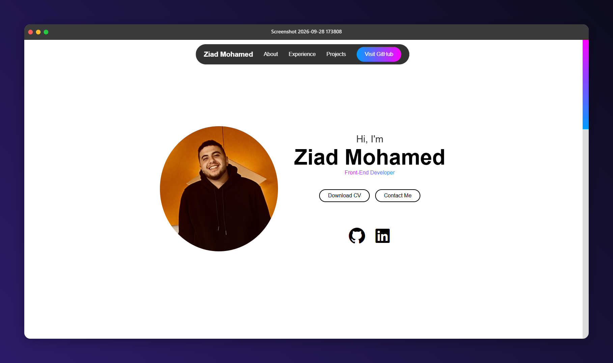

# Ziad Mohamed | Portfolio

A personal portfolio website showcasing my frontend projects, skills, and how to get in touch. Built while transitioning into frontend development, with the goal of becoming a full stack developer.

**[🔗 Live Demo](https://ziadmohamed1911.github.io/my-portfolio-page/)**



## Features

- Responsive layout that works on mobile, tablet, and desktop
- About section with my background and skills
- Projects section with live links and source code
- Contact section with links to my profiles
- Clean, accessible markup and semantic HTML

## Tech Stack

- HTML5
- CSS3 (Flexbox / Grid)
- JavaScript (ES6+)
- Git & GitHub
- Deployed with GitHub Pages

## What I Practiced

- Building responsive layouts from scratch
- Writing semantic, accessible HTML
- Organizing CSS and JavaScript in a maintainable way
- Reached 100% on accessibilty rate according to LightHouse Dev Tool

## Getting Started

```bash
# Clone the repository
git clone https://github.com/ziadmohamed1911/my-portfolio-page/


## Project Structure

```
├── index.html
├── style.css
│── main.js
├── images/
└── screenshots/
```

## Roadmap
- [ ] Add more projects
- [ ] Add dark mode

## Contact

- **LinkedIn:** [my-linkedin]https://www.linkedin.com/in/ziad-mohamed-905a2129b/
- **GitHub:** [my-username](https://github.com/ziadmohamed1911)
- **Email:** ziadabdellateef7@outlook.com
